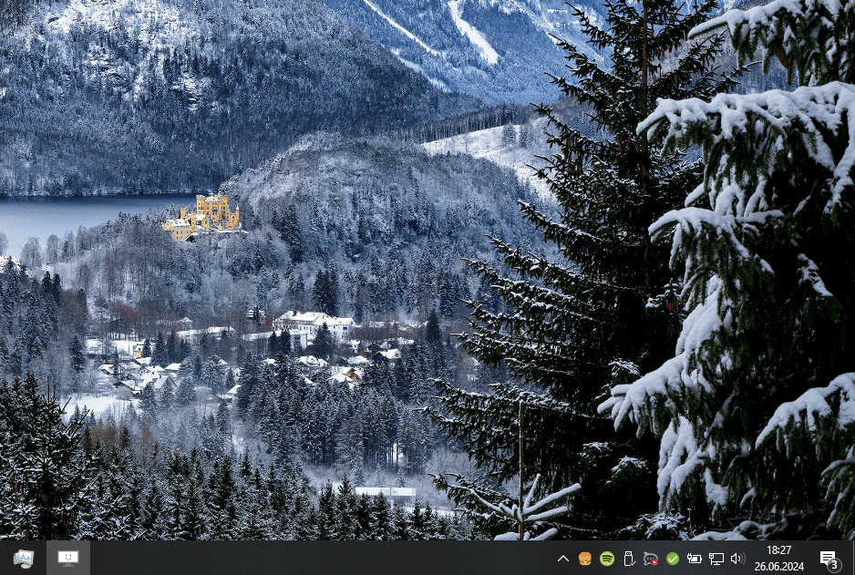

# MenaEssen 🍔
Windows only keine Pläne die Anwendung zu Protierung auf andere Systeme

⚡500kb an Speicherplatz

⚡23MB an Arbeitsspeicher




Dies ist eine kleine Anwendung, die was sehr spezifisches tun soll:
- Sitze im Anwendungstray bis man draufklickt.
- Zeige dir die Gerichte in der Mensa an

Wie stelle ich meine Mena ein?
- Öffne die MensaEssen.dll.config und änder die Mensa URL ab

Wie schließe ich die App?
- Rechtsklick auf den Tray und auf schließen klicken

App zum Autostart hinzufügen:
- mach eine Verknüpfung zur exe und verschiebe sie nach : ```~/AppData\Roaming\Microsoft\Windows\ Startmenü\Programme\Autostart```

Funktionierende Menüs (Stand 26.06.2024):

```https://www.swerk-wue.de/bamberg/essen-trinken/mensen-speiseplaene/mensa-feldkirchenstrasse-bamberg/menu```

```https://www.swerk-wue.de/bamberg/essen-trinken/mensen-speiseplaene/mensa-austrasse-bamberg/menu```

```https://www.swerk-wue.de/schweinfurt/essen-trinken/mensen-speiseplaene/mensa-thws-campus-schweinfurt/menu```

```https://www.swerk-wue.de/aschaffenburg/essen-trinken/mensen-speiseplaene/mensa-hochschulcampus-aschaffenburg/menu```

```https://www.swerk-wue.de/wuerzburg/essen-trinken/mensen-speiseplaene/mensa-josef-schneider-strasse-wuerzburg/menu```

```https://www.swerk-wue.de/wuerzburg/essen-trinken/mensen-speiseplaene/mensa-roentgenring-wuerzburg/menu```

```https://www.swerk-wue.de/wuerzburg/essen-trinken/mensen-speiseplaene/mensa-am-studentenhaus-wuerzburg/menu```

```https://www.swerk-wue.de/wuerzburg/essen-trinken/mensen-speiseplaene/mensateria-campus-hubland-nord-wuerzburg/menu```
